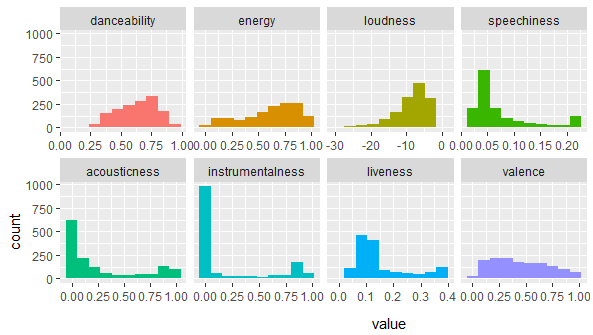

# Spotify-music-clustering-analysis-usingR
Cluster analysis on Spotify audio features

Problem definition: 
Examine a set of audio_features of songs and using clustering techniques identify potential genres.
The goal is define genres and their characteristics.

## 1.1 Explore the data
Data file contains 1657 rows and 12 Spotify audio features:

 
 
Songs were extracted using spotify API using sportifyr R package

## 1.2 Choose algorithms
I used three different type of clustering:
- PAM K-Medoids clustering
- Agglomerative clustering
- Density based clustering

## 1.3 Dimentionality Reduction and Visualization

- PCA
- TSNE

# Clustering audio tracks and compare with existing genres

Problem definition: 
Created segmentation on dataset of audio tracks.
Extracted genres to compare results.

# Results:

